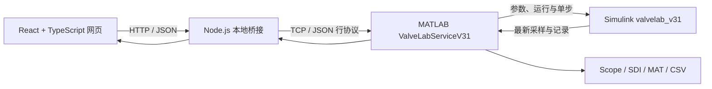

# ValveLab 3.1

一个用于阀门原理教学、控制实验和 MATLAB/Simulink 联合仿真的本地实验平台。

ValveLab 将交互式阀门结构展示、参数调节和实验引导放在浏览器中，将动态计算、波形记录与分析交给 MATLAB/Simulink R2025b。网页显示的阀位、流量和控制器状态均来自 Simulink 的最新采样，不使用浏览器端替代数据，也不代表实体阀门测量值。

> 当前版本：3.1.0 · 运行平台：Windows · 界面语言：中文 · 许可证：[GPL-3.0-only](./LICENSE)

## 项目亮点

- **五种阀门可视化**：球阀、蝶阀、闸阀、截止阀和调节阀具有不同的内部结构、运动方式与教学流量特性。
- **手动与 PID 控制**：对比阀位命令 `u`、实际阀位 `x`、真实流量 `Q`、测量反馈 `PV` 和设定值 `SP`。
- **执行机构与过程参数**：可调整电动或气动机构、机构时间常数、最大行程速度、入口/出口压力和传感器时间常数。
- **故障注入**：支持阀杆卡死、能源中断、阀座泄漏和传感器偏差，便于定位控制链中的异常。
- **六个引导实验**：用固定初始条件和事件时刻复现阀位跟随、PID 跟踪、压差扰动、传感器滞后、故障恢复和一阶响应。
- **MATLAB 原生分析**：可打开 Scope、Simulation Data Inspector 和带事件标记的全程分析图。
- **可追溯实验记录**：将完整采样保存为 MAT 和 CSV，并在 SDI 中对比两次实际运行。
- **安全的本地连接**：网页、桥接和 MATLAB 服务均只监听 `127.0.0.1`；多页面观察时只有一个页面拥有控制权。

## 系统要求

| 组件 | 要求 |
| --- | --- |
| 操作系统 | Windows 10/11 |
| Shell | PowerShell 7 |
| Node.js | 22.12 或更高版本 |
| MATLAB | R2025b，安装在 `C:\Program Files\MATLAB\R2025b` |
| MathWorks 产品 | Simulink、Instrument Control Toolbox |

当前启动脚本使用固定的 MATLAB R2025b 安装路径。项目不需要 Simulink Coder、MATLAB Compiler 或 MEX 编译。

## 快速开始

克隆仓库并安装前端依赖：

```powershell
git clone https://github.com/CC-maple/ValvesLab.git
Set-Location .\ValvesLab
npm install
```

在仓库根目录运行统一启动脚本：

```powershell
pwsh -File .\scripts\Start-ValveLab.ps1
```

脚本会依次检查并启动网页、Node 桥接和专用 MATLAB 会话，同时验证协议版本、MATLAB 版本和 Simulink 模型。终端出现以下提示后即可继续：

```text
VALVELAB_V31_READY: web + bridge + MATLAB model verified.
```

打开 [http://127.0.0.1:5173/](http://127.0.0.1:5173/)，点击“连接 MATLAB 控制”。连接后模型处于暂停状态，不会自动开始仿真。

启动日志保存在 `output/runtime`。脚本可重复执行；若现有服务与 V3.1 协议兼容，它不会重复启动服务或重置当前实验。

### 手动启动

统一脚本已正常运行时，无须执行以下步骤。需要分别排查服务时，可在两个 PowerShell 终端中运行：

```powershell
npm run dev
```

```powershell
npm run bridge
```

然后在 MATLAB 命令窗口中运行：

```matlab
addpath(fullfile(pwd, 'matlab'))
start_valvelab
```

手动启动前请确认 MATLAB 当前目录是仓库根目录。

## 第一次实验

1. 启动全部服务并在网页中取得控制权。
2. 保持默认调节阀、手动模式和 65% 初始阀位。
3. 将阀位命令改为 30%，点击“开始”，观察实际阀位受机构动态和行程速度限制而逐步跟随。
4. 点击“暂停”，切换到 PID 自动模式，设置目标流量和 PID 增益。
5. 打开“波形”，在 MATLAB 中查看 `SP / Q / PV`、`u / x` 或 `P / I / D`。
6. 为实验命名并选择“暂停并保存 MAT / CSV”，保留完整采样用于后续分析。

参数输入在按 Enter 或失去焦点后提交；PID 的 `Kp`、`Ki`、`Kd` 作为一组参数统一应用。页面会区分“待发送”“MATLAB 已接受”和“实际采样已生效”。模型暂停时，新参数可以被接受，但反馈值要到下一次仿真采样后才会变化。

## 控制链与主要信号

```text
SP → PID → 阀位命令 u → 执行机构 → 实际阀位 x → 阀门与压差 → 真实流量 Q
↑                                                                              │
└──────────────────────────── 测量反馈 PV ← 传感器 ←────────────────────────────┘
```

| 信号 | 含义 | 单位 |
| --- | --- | --- |
| `SP` / `setpoint` | PID 目标流量 | L/min |
| `u` / `command` | 手动或 PID 输出的阀位命令 | % |
| `x` / `opening` | 执行机构输出的实际阀位 | % |
| `Q` / `trueFlow` | 阀门模型计算的真实流量 | L/min |
| `PV` / `measuredFlow` | 经过传感器动态和故障通道的反馈 | L/min |
| `P / I / D` | 三个控制项对阀位命令的实时贡献 | % |

判断动态现象时可以分别观察三个差值：`SP - PV` 是控制误差，`u - x` 是机构跟踪差，`PV - Q` 是测量与过程差。

Simulink 固定步长为 0.05 s。网页约每 250 ms 获取一次最新状态，传感器时间常数默认 0.2 s；仿真步长、网页刷新周期和物理时间常数是三个不同概念。

## 六个学习实验

| 实验 | 固定过程 | 重点观察 |
| --- | --- | --- |
| 01 命令与阀位 | 手动命令 30%，在 5 s 阶跃至 70% | `u` 与 `x` 为何不能同步跳变 |
| 02 PID 跟踪 | `SP` 从 60 阶跃至 75 L/min | `SP`、`PV`、`Q` 和阀位之间的关系 |
| 03 压差扰动 | 10 s 时压差降至 0.25 bar，20 s 恢复 | 目标不可达、输出饱和与积分状态 |
| 04 传感器滞后 | 在不同传感器时间常数下重复 30% → 70% | `Q` 与 `PV` 的动态差异 |
| 05 故障与恢复 | 10 s 卡死，12 s 提高目标，20 s 清除故障 | 卡死期间 `u` 与 `x` 分离 |
| 06 为何是 63.2% | MATLAB 独立一阶传感器阶跃 | `1τ` 的 63.2% 与 `3τ` 的 95.0% |

前五个实验从相同的初始阀位和仿真时间开始，在 30 s 自动暂停。准备实验时，已有采样会先自动保存；手动修改实验参数会取消尚未执行的预设事件。

## 实验示例

<details>
<summary><strong>示例：比较两组 PI 参数对大设定值阶跃的影响</strong></summary>

保持调节阀、压力、执行机构和传感器参数不变，先使用 `Kp=2.2, Ki=0.8, Kd=0`，再使用 `Kp=2.0, Ki=0.8, Kd=0`，分别执行 30 → 60 L/min 的设定值阶跃。每次实验都同时查看流量、阀位和 PID 三组 Scope，并保存记录用于 SDI 对比。

当 `Kd=0` 时，控制器为：

```math
e = SP - PV
```

```math
u = \operatorname{clamp}(K_p e + I,\ 0,\ 100)
```

`Kp=2.2` 时，30 L/min 的阶跃会使比例项瞬时变化 66%；`Kp=2.0` 时为 60%。旧工作点的积分仍维持原阀位，而执行机构受默认 0.8 s 时间常数和 12 %/s 行程速度限制，测量流量还受默认 0.2 s 传感器时间常数影响，因此较积极的比例作用可能带来更明显的超调。

模型已有条件积分抗饱和，但它不能消除比例突跳、机构限速和测量滞后。误差接近零时，已累积的积分仍用于维持稳态阀位，不应仅因误差归零就清空积分。

如果仍希望减小超调，可继续比较 `Kp=2.0, Ki=0.7, Kd=0`。一次只改变一个增益，重点区分以下现象：

- `SP - PV` 较大：控制误差尚未消除。
- `u` 达到 0% 或 100%：控制器输出饱和。
- `u - x` 较大：执行机构响应或行程速度成为限制。
- `PV - Q` 较大：传感器动态或偏差影响反馈。

也可以把 30 → 60 L/min 分成 30 → 40 → 50 → 60，每隔约 1 s 提高一次，近似构造 10 L/min/s 的人工设定值斜坡。它通常能减小比例冲击和超调，但不适合代替直接阶跃的最坏动态响应测试。

</details>

## 波形、保存与对比

网页中的波形入口在本机 MATLAB 会话中打开原生工具：

- **Flow Scope**：`SP`、`Q` 和 `PV`。
- **Position Scope**：阀位命令 `u` 和实际阀位 `x`。
- **PID Scope**：`P`、`I` 和 `D` 的贡献，可分轴或同轴查看。
- **Simulation Data Inspector**：当前运行的命名信号以及已导入的运行记录。
- **全程分析图**：完整采样和参数实际生效时刻。

Scope 默认显示最近 20 s，可切换 5、10、20 或 60 s，也可在暂停后查看全部或指定时间段。

实验文件保存在 `matlab/runs/v3.1`：

- CSV 包含 20 列实际采样。
- MAT 额外保存配置版本、接受/生效时刻、参数事件、课程信息和实验元数据。
- 网页列出最近 30 份 V3.1 记录；更早的文件仍保留在磁盘。

在 MATLAB 中重新打开记录：

```matlab
fig = analyze_valvelab_v31('C:\path\to\valvelab_timestamp.mat');
data = load('C:\path\to\valvelab_timestamp.mat');
signals = data.run.signals;
```

## 架构



这种分工确保 MATLAB/Simulink 是动态状态和实验记录的唯一事实来源。网页只负责参数输入、状态展示和操作编排；断连后会明确显示最后一次反馈，不会继续生成本地仿真曲线。

多个页面可以同时观察同一模型，但只有取得控制权的页面能够修改参数。控制端心跳中断超过 3 s 时，MATLAB 会暂停并释放控制权；重新连接后必须手动开始。

### 本地端口

| 端口 | 服务 |
| --- | --- |
| 5173 | Vite 开发网页 |
| 4173 | 可选生产预览 |
| 8765 | V3.1 Node HTTP 桥接 |
| 8776 | V3.1 MATLAB TCP 服务 |
| 8766 | 旧版 V3 MATLAB 服务，V3.1 不使用 |

## 项目结构

```text
ValvesLab/
├─ bridge/                       # HTTP 与 MATLAB TCP 之间的本地桥接
├─ docs/                         # V1–V3.1 方案与验证记录
├─ matlab/                       # Simulink 模型、服务、Scope、分析和验证脚本
├─ scripts/                      # 一键启动与自动验证脚本
├─ src/
│  ├─ components/               # 页面组件和 V3.1 教学面板
│  ├─ domain/                   # 阀门、执行机构、故障和共享类型
│  ├─ legacy/browserSimulation/ # 仅用于迁移基准的 V2 浏览器求解器
│  ├─ matlab/                   # 网页侧 MATLAB 桥接状态管理
│  └─ valves/                   # 五种阀门的结构绘制
└─ README.md
```

关键实现文件：

| 文件 | 职责 |
| --- | --- |
| `src/App.tsx`、`src/v31.css` | 工作区、反馈、分析和记录界面 |
| `src/domain/valveData.ts` | 五种阀门的教学资料与属性 |
| `src/matlab/useMatlabBridge.ts` | 状态轮询、心跳、参数队列和操作确认 |
| `matlab/valvelab_v31.slx` | V3.1 Simulink 模型和 20 个记录信号 |
| `matlab/valvelab_model_v31.m` | 阀门、执行机构、PID、传感器和故障方程 |
| `matlab/valvelab_sfun_v31.m` | 固定步长 S-function、DWork 状态与配置生效版本 |
| `matlab/ValveLabServiceV31.m` | TCP 协议、仿真调度、控制权、课程、保存与分析 |
| `bridge/server.mjs` | 本地来源校验、命令白名单和 HTTP/TCP 转发 |

V3 文件仍保留为迁移基准。V3.1 运行入口不会导入 `src/legacy/browserSimulation` 中的旧 TypeScript 动态求解器。

## 开发与验证

前端静态检查、模型基准和生产构建：

```powershell
npm run verify
npm run build
```

V3 协议夹具检查：

```powershell
node --experimental-strip-types .\scripts\verify-v3-fixtures.ts
```

完整 MATLAB/Simulink V3.1 验证：

```powershell
matlab -batch "addpath('matlab'); verify_valvelab_v31"
```

MATLAB 验证使用独立的 18766 测试端口，并可能生成测试运行和导出文件。详细结果和验证边界见 [V3.1 验证记录](./docs/VALIDATION_v3.1.md)，设计取舍见 [V3.1 方案](./docs/ValvesLab_v3.1.md)。

## 常见问题

### 页面显示“服务未就绪”

检查 `output/runtime` 中网页和桥接日志，确认 5173 与 8765 端口没有被其他项目占用。启动脚本会校验服务协议，端口处于监听状态并不等于服务兼容。

### 页面显示“等待 MATLAB”

等待 MATLAB 日志出现 `VALVELAB_V31_READY`。若 8776 已被占用，请确认是否已有 V3.1 服务运行；不要在多个 MATLAB 会话中重复启动同一服务。

### 修改 MATLAB 类文件后没有生效

在启动 ValveLab 的 MATLAB 会话中运行：

```matlab
delete(valvelab_service)
```

随后重新启动该 MATLAB 会话。此操作只释放服务对象，不删除任何实验文件。

### 关闭启动终端后服务仍在运行

统一脚本以后台进程启动 Node 服务。根据启动输出或日志中的 PID，在任务管理器中结束对应的 `web-v31` 和 `bridge-v31` 进程。

### 为什么切换页面后仿真暂停

浏览器可能挂起后台页面并停止心跳。MATLAB 在超过 3 s 未收到控制端心跳后会主动暂停，这是防止无人控制时继续运行的保护机制。

## 模型边界

ValveLab 是教学近似模型，不是工业设计、选型或安全验证工具。当前模型采用固定水样介质和正向准稳态压差，不包含独立管路动力学、反向流动、气蚀、工业安全联锁、硬实时保障或实体阀门标定。页面中的流线和粒子用于解释结构与流动趋势，不求解 CFD。

单次运行的仿真时间上限为 1800 s。仿真由 MATLAB 定时调度离散步骤，仿真时间不保证与墙钟时间严格一致。

## 文档与许可证

- [V3.1 设计与实施说明](./docs/ValvesLab_v3.1.md)
- [V3.1 验证记录](./docs/VALIDATION_v3.1.md)
- [历史方案与验证文档](./docs)
- [GNU General Public License v3.0 only](./LICENSE)

本项目以 GPL-3.0-only 许可发布。分发本项目或其修改版本时，请遵守许可证对源代码和许可证文本的要求。
